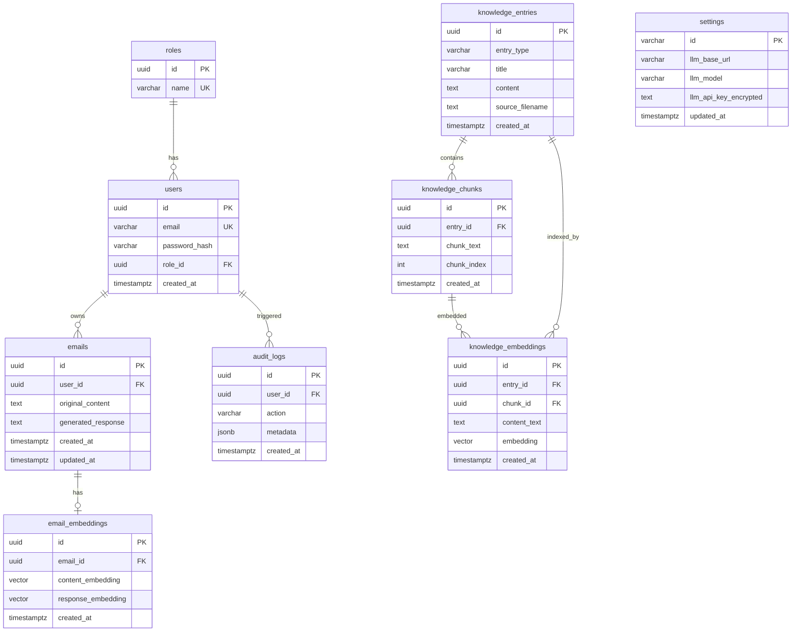

# Database Schema & Persistence

## 1. Overview
MailMate uses **PostgreSQL 16+** as its primary relational engine. In addition to standard relational features, it utilizes the **`pgvector`** extension to facilitate high-performance vector similarity searches, which are core to the RAG (Retrieval-Augmented Generation) capability.

---

## 2. Entity Relationship Diagram

---

## 3. Table Details

### `roles`
Stores role definitions for RBAC. Seeded with `admin` and `user` roles.

| Column | Type | Constraints |
|---|---|---|
| `id` | `UUID` | PRIMARY KEY, DEFAULT `gen_random_uuid()` |
| `name` | `VARCHAR(50)` | UNIQUE, NOT NULL |

### `users`
User accounts with bcrypt-hashed passwords.

| Column | Type | Constraints |
|---|---|---|
| `id` | `UUID` | PRIMARY KEY, DEFAULT `gen_random_uuid()` |
| `email` | `VARCHAR(255)` | UNIQUE, NOT NULL |
| `password_hash` | `VARCHAR(255)` | NOT NULL |
| `role_id` | `UUID` | FK → `roles.id`, DEFAULT user role |
| `created_at` | `TIMESTAMPTZ` | DEFAULT `NOW()` |

### `emails`
Generated email records, one per generation request.

| Column | Type | Constraints |
|---|---|---|
| `id` | `UUID` | PRIMARY KEY, DEFAULT `gen_random_uuid()` |
| `user_id` | `UUID` | FK → `users.id` ON DELETE CASCADE |
| `original_content` | `TEXT` | NOT NULL (incoming email text) |
| `generated_response` | `TEXT` | The AI-generated reply |
| `created_at` | `TIMESTAMPTZ` | DEFAULT `NOW()` |
| `updated_at` | `TIMESTAMPTZ` | DEFAULT `NOW()` |

### `email_embeddings`
Vector embeddings for email similarity search (RAG context retrieval).

| Column | Type | Constraints |
|---|---|---|
| `id` | `UUID` | PRIMARY KEY, DEFAULT `gen_random_uuid()` |
| `email_id` | `UUID` | FK → `emails.id` ON DELETE CASCADE |
| `content_embedding` | `VECTOR` | Embedding of the original email |
| `response_embedding` | `VECTOR` | Embedding of the generated response |
| `created_at` | `TIMESTAMPTZ` | DEFAULT `NOW()` |

### `knowledge_entries`
Knowledge base entries — Q&A pairs and uploaded documents.

| Column | Type | Constraints |
|---|---|---|
| `id` | `UUID` | PRIMARY KEY, DEFAULT `gen_random_uuid()` |
| `entry_type` | `VARCHAR(50)` | NOT NULL (`qa_pair` or `document`) |
| `title` | `VARCHAR(500)` | NOT NULL |
| `content` | `TEXT` | Full content (answer for Q&A, full text for documents) |
| `source_filename` | `VARCHAR(255)` | Original filename for uploaded documents |
| `created_at` | `TIMESTAMPTZ` | DEFAULT `NOW()` |

### `knowledge_chunks`
Document chunks produced by semantic text splitting.

| Column | Type | Constraints |
|---|---|---|
| `id` | `UUID` | PRIMARY KEY, DEFAULT `gen_random_uuid()` |
| `entry_id` | `UUID` | FK → `knowledge_entries.id` ON DELETE CASCADE |
| `chunk_text` | `TEXT` | NOT NULL |
| `chunk_index` | `INTEGER` | NOT NULL (ordering within document) |
| `created_at` | `TIMESTAMPTZ` | DEFAULT `NOW()` |

### `knowledge_embeddings`
Vector embeddings for knowledge base retrieval.

| Column | Type | Constraints |
|---|---|---|
| `id` | `UUID` | PRIMARY KEY, DEFAULT `gen_random_uuid()` |
| `entry_id` | `UUID` | FK → `knowledge_entries.id` ON DELETE CASCADE |
| `chunk_id` | `UUID` | FK → `knowledge_chunks.id` ON DELETE CASCADE (nullable) |
| `content_text` | `TEXT` | The text that was embedded |
| `embedding` | `VECTOR` | The embedding vector |
| `created_at` | `TIMESTAMPTZ` | DEFAULT `NOW()` |

### `settings`
Singleton LLM configuration (only one row: id = `'singleton'`).

| Column | Type | Constraints |
|---|---|---|
| `id` | `VARCHAR(20)` | PRIMARY KEY (value: `'singleton'`) |
| `llm_base_url` | `VARCHAR(255)` | NOT NULL |
| `llm_model` | `VARCHAR(100)` | NOT NULL |
| `llm_api_key_encrypted` | `TEXT` | AES-256-GCM encrypted API key |
| `updated_at` | `TIMESTAMPTZ` | DEFAULT `NOW()` |

### `audit_logs`
Immutable audit trail for security-sensitive actions.

| Column | Type | Constraints |
|---|---|---|
| `id` | `UUID` | PRIMARY KEY, DEFAULT `gen_random_uuid()` |
| `user_id` | `UUID` | FK → `users.id` ON DELETE SET NULL |
| `action` | `VARCHAR(100)` | NOT NULL (e.g., `user.created`, `settings.updated`) |
| `metadata` | `JSONB` | Action-specific data |
| `created_at` | `TIMESTAMPTZ` | DEFAULT `NOW()` |

---

## 4. Specialized Data Types

### Vector (pgvector)
The `email_embeddings` and `knowledge_embeddings` tables use the `vector` type from the `pgvector` extension.
- **Dimension**: Flexible (no dimension limit enforced — adapts to embedding model output)
- **Models**: Gemini `gemini-embedding-001` (768 dimensions)
- **Search Operator**: `<=>` (Cosine Distance) for semantic similarity search
- **Use Case**: Find contextually similar emails and knowledge entries to augment LLM prompts

### JSONB (Audit Logs)
The `audit_logs.metadata` column uses PostgreSQL's `JSONB` type for flexible, queryable action metadata. Examples:
- User creation: `{"email": "user@example.com"}`
- Role update: `{"old_role": "user", "new_role": "admin"}`
- Settings change: `{"field": "llm_model", "new_value": "llama-3.3-70b"}`

---

## 5. Migration History

| Migration | Description |
|---|---|
| `20260327094833` | Create `users` table |
| `20260327104236` | Create `roles` table, add `role_id` FK to users |
| `20260327104237` | Seed default roles (`admin`, `user`) |
| `20260327131213` | Create `emails` and `email_embeddings` tables |
| `20260422115000` | Create `settings` table |
| `20260422125345` | Remove vector dimension limit |
| `20260429091930` | Create `audit_logs` table |
| `20260505170000` | Seed admin user account |
| `20260513120000` | Create knowledge base tables (`knowledge_entries`, `knowledge_chunks`, `knowledge_embeddings`) |

---

## 6. Security & Isolation
- **Row-Level Awareness**: All email queries are scoped by `user_id` — users can only access their own data
- **Cascading Deletes**: `ON DELETE CASCADE` on email → embeddings, knowledge → chunks/embeddings
- **Audit Preservation**: `ON DELETE SET NULL` on audit_logs → users (logs survive user deletion)
- **Encryption at Rest**: LLM API keys stored in `settings.llm_api_key_encrypted` using AES-256-GCM
- **No Plaintext Secrets**: API keys are never stored or transmitted in plaintext
