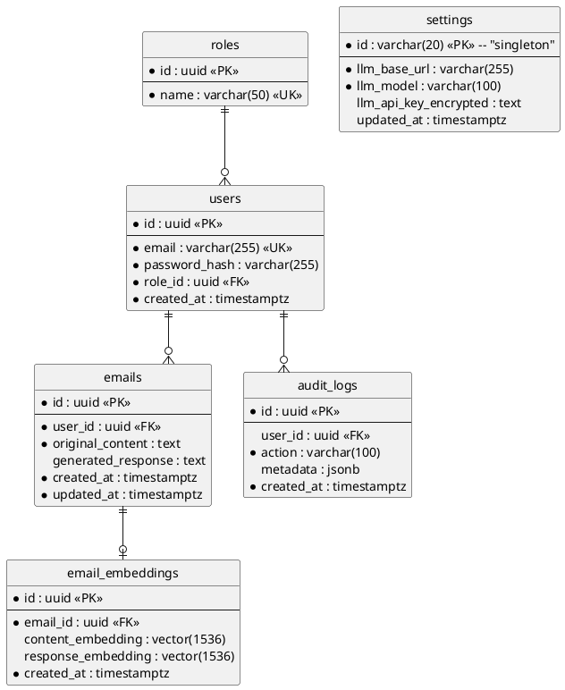

# Database Schema & Persistence

## 1. Overview
Mailwise uses **PostgreSQL 16+** as its primary relational engine. In addition to standard relational features, it utilizes the **`pgvector`** extension to facilitate high-performance vector similarity searches, which are core to the RAG (Retrieval-Augmented Generation) capability.

---

## 2. Entity Relationship Diagram (PlantUML)

---

## 3. Specialized Data Types

### Vector (pgvector)
The `email_embeddings` table uses the `vector` type. 
- **Dimension**: Defaults to 1536 (matching OpenAI `text-embedding-3-small`).
- **Indexing**: Uses **HNSW** (Hierarchical Navigable Small Worlds) for fast approximate nearest neighbor search.
- **Search Operator**: `<=>` (Cosine Distance) is used to find contextually similar emails.

### JSONB (Audit Logs)
The `audit_logs` table uses `jsonb` for the `metadata` column. This allows for flexible storage of action-specific data (e.g., old vs new role name) while maintaining efficient queryability.

---

## 4. Migration Strategy
Migrations are managed via **SQLx** in the `backend/migrations/` directory.
- Every change to the schema is tracked as a versioned `.sql` file.
- Migrations are applied automatically during local development and CI/CD pipelines using `sqlx-cli`.

## 5. Security & Isolation
- **Row Level Awareness**: All email queries are scoped by `user_id` to ensure data isolation.
- **Foreign Keys**: Strict `ON DELETE CASCADE` or `ON DELETE SET NULL` policies are enforced to maintain referential integrity (e.g., when a user is deleted, their emails are cascaded, but audit logs remain with a null user reference).
