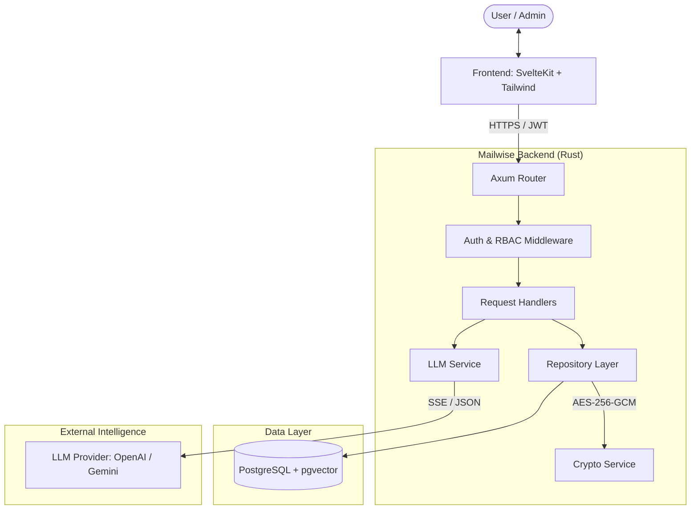

# Project Overview & Architecture

## 1. Project Definition
**Mailwise** is an enterprise-grade AI-powered email assistant designed to automate and enhance professional correspondence. It utilizes **Retrieval-Augmented Generation (RAG)** to learn from a user's past communication style and facts, ensuring that AI-generated replies are contextually accurate and tone-consistent.

---

## 2. System Architecture Diagram

---

## 3. Technology Stack

### Frontend
- **Framework**: [SvelteKit](https://kit.svelte.dev/)
- **Styling**: Vanilla CSS + Tailwind-inspired Custom Design System.
- **State Management**: Svelte Stores.
- **Communication**: Fetch API (JSON) & EventSource (SSE for real-time streaming).

### Backend
- **Language**: [Rust](https://www.rust-lang.org/)
- **Web Framework**: [Axum](https://github.com/tokio-rs/axum)
- **Runtime**: [Tokio](https://tokio.rs/)
- **Database Access**: [SQLx](https://github.com/launchbadge/sqlx) (Type-safe async SQL).
- **Security**: 
    - `jsonwebtoken` for auth.
    - `bcrypt` for password hashing.
    - `aes-gcm` for data-at-rest encryption.

### Database & AI
- **Database**: [PostgreSQL](https://www.postgresql.org/)
- **Vector Search**: [pgvector](https://github.com/pgvector/pgvector) (for RAG similarity searching).
- **LLM Integration**: OpenAI GPT-4o / Google Gemini via Unified LlmService.

---

## 4. Key Workflows

### The RAG Cycle (Generation)
1. User submits an incoming email.
2. Backend generates an embedding of the incoming text.
3. Backend performs a **Cosine Similarity Search** in PostgreSQL to find relevant past replies.
4. Past context + new email are sent to the LLM.
5. Response is streamed back to the user via **Server-Sent Events (SSE)**.
6. New generation is indexed and stored for future use.

### Security Hardening
- **Encryption**: LLM API keys are never stored in plaintext.
- **RBAC**: Strict role checks prevent regular users from accessing administrative settings or audit logs.
- **Rate Limiting**: Brute-force protection on authentication endpoints.
