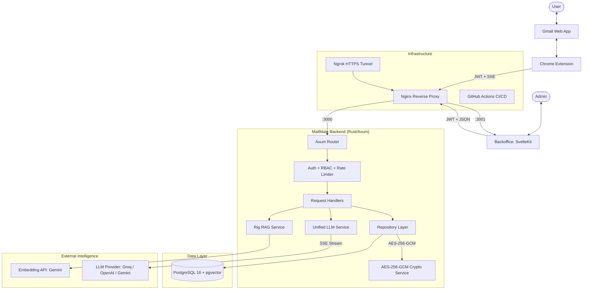
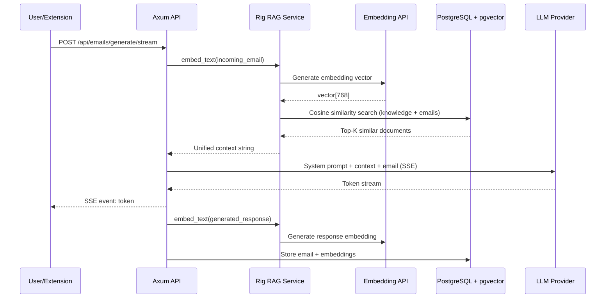
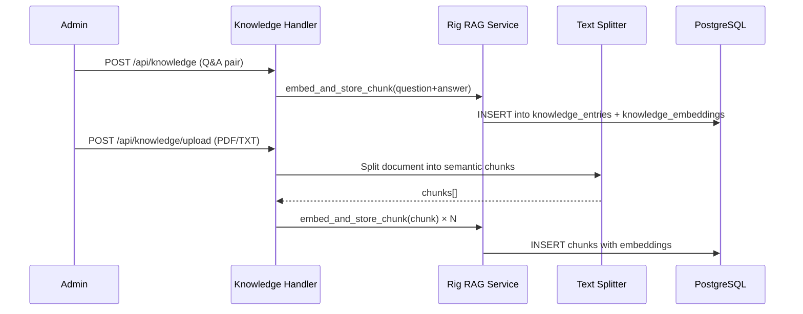

# MailMate — Project Overview & Architecture

## 1. Project Definition

**MailMate** is an enterprise-grade AI-powered email assistant designed to automate and enhance professional correspondence. It utilizes **Retrieval-Augmented Generation (RAG)** powered by the **Rig framework** to learn from a user's past communication style, organizational knowledge base documents, and Q&A pairs, ensuring that AI-generated replies are contextually accurate and tone-consistent.

The system is composed of three main components:
- **Backend** — A high-performance Rust API server built with Axum
- **Backoffice** — A SvelteKit admin dashboard for system management
- **Chrome Extension** — A Gmail integration that injects AI generation directly into the email compose flow

---

## 2. System Architecture Diagram



---

## 3. Technology Stack

### Backend
| Technology | Purpose |
|---|---|
| **Rust 1.75+** | Systems programming language — memory safety, performance |
| **Axum 0.8** | Async web framework built on Tokio |
| **Tokio** | Async runtime for concurrent I/O |
| **SQLx 0.7** | Compile-time checked async SQL with PostgreSQL |
| **Rig Core 0.36** | RAG framework for embedding + retrieval orchestration |
| **bcrypt** | Password hashing (cost factor 12) |
| **jsonwebtoken** | JWT creation and validation |
| **aes-gcm** | AES-256-GCM encryption for API keys at rest |
| **utoipa** | OpenAPI/Swagger documentation generation |
| **text-splitter** | Semantic-aware document chunking for RAG |
| **pdf-extract** | PDF document text extraction |

### Frontend (Backoffice)
| Technology | Purpose |
|---|---|
| **SvelteKit 2** | Full-stack web framework with SSR |
| **Svelte 5** | Reactive UI with runes ($state, $derived) |
| **TailwindCSS 4** | Utility-first CSS framework |
| **Lucide Icons** | Consistent icon library |
| **Vite** | Build tool and dev server |

### Chrome Extension
| Technology | Purpose |
|---|---|
| **Manifest V3** | Modern Chrome extension architecture |
| **Service Worker** | Background script for API communication |
| **Content Script** | Gmail DOM injection for the Generate Reply button |

### Database & AI
| Technology | Purpose |
|---|---|
| **PostgreSQL 16** | Primary relational database |
| **pgvector** | Vector similarity search extension |
| **Gemini Embedding API** | Text-to-vector embedding generation |
| **Groq / OpenAI / Gemini** | LLM completion providers (configurable) |

### Infrastructure
| Technology | Purpose |
|---|---|
| **Nginx** | Reverse proxy (ports 80, 2224, 2226) |
| **GitHub Actions** | CI/CD pipeline with self-hosted runner |
| **systemd** | Process management on ISEP VM |
| **Ngrok** | HTTPS tunnel for public access |

---

## 4. Key Workflows

### The RAG Cycle (Email Generation)


### Knowledge Base Ingestion


### Authentication Flow
1. User submits credentials via login form or Chrome extension popup
2. Backend validates against bcrypt hash in PostgreSQL
3. JWT token issued (configurable expiration, default 24h)
4. Token stored in HttpOnly cookie (backoffice) or chrome.storage.local (extension)
5. All subsequent API requests include `Authorization: Bearer <token>`
6. RBAC middleware checks user role before granting access to admin endpoints

### Google OAuth2 Flow
1. User clicks "Sign in with Google" on the backoffice login page
2. Backend redirects to Google OAuth2 consent screen
3. Google redirects back with authorization code
4. Backend exchanges code for Google ID token
5. User is created or matched by email, JWT issued

---

## 5. Deployment Architecture

```
┌─────────────────────────────────────────────────────────────────┐
│                    ISEP VM (vs224.dei.isep.ipp.pt)              │
│                                                                 │
│  ┌──────────┐     ┌─────────────┐     ┌──────────────────────┐ │
│  │  Nginx   │────▶│ SvelteKit   │     │  PostgreSQL 16       │ │
│  │ :80/2224 │     │ :3001       │     │  :5432               │ │
│  │          │     └─────────────┘     │  + pgvector extension│ │
│  │          │────▶┌─────────────┐     └──────────────────────┘ │
│  │          │     │ Rust/Axum   │────────────────▲              │
│  │          │     │ :3000       │                │              │
│  └──────────┘     └─────────────┘                │              │
│       ▲                                          │              │
│       │ Ngrok Tunnel                             │              │
│       ▼                                          │              │
│  https://dreamy-swimwear-daffodil.ngrok-free.dev │              │
└─────────────────────────────────────────────────────────────────┘
```

---

## 6. Security Hardening
- **Encryption at Rest**: LLM API keys encrypted with AES-256-GCM before storage
- **RBAC**: Strict role-based access control — admin-only endpoints enforced at middleware level
- **Rate Limiting**: IP-based rate limiting on authentication endpoints to prevent brute-force attacks
- **JWT Validation**: All API endpoints require valid, non-expired JWT tokens
- **Data Isolation**: Email queries are always scoped by `user_id` — users can only access their own data
- **CORS**: Configured to allow the Chrome extension (from `mail.google.com`) and the backoffice domain
- **Password Security**: Passwords hashed with bcrypt (cost factor 12), never stored in plaintext
