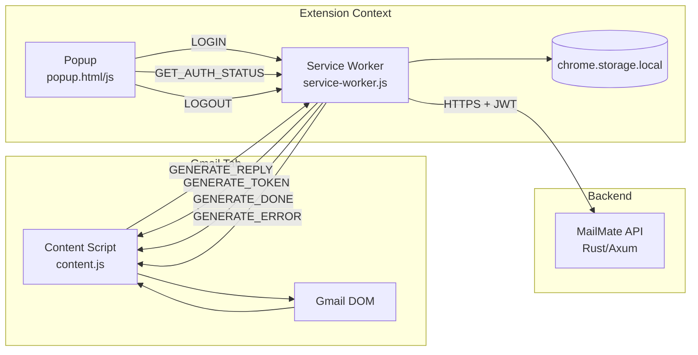

# Chrome Extension Technical Documentation

## 1. Overview

The MailMate Chrome Extension integrates the AI email generation capability directly into **Gmail**. It injects a **"✨ Generate Reply"** button into Gmail's compose toolbar, allowing users to generate AI-powered email replies without leaving their inbox.

**Architecture**: Manifest V3  
**Target**: Gmail (`https://mail.google.com`)  
**API**: Connects to the MailMate backend via HTTPS

---

## 2. Project Structure

```
extension/
├── manifest.json         # Chrome extension manifest (V3)
├── service-worker.js     # Background script — API communication, SSE parsing
├── content.js            # Content script — Gmail DOM injection
├── popup.html            # Extension popup — login/status UI
├── popup.js              # Popup logic — login form, auth state
├── styles.css            # Gmail-injected styles for button and toast
└── icons/
    ├── icon16.png        # Toolbar icon (16×16)
    ├── icon48.png        # Extension icon (48×48)
    └── icon128.png       # Chrome Web Store icon (128×128)
```

---

## 3. Architecture



---

## 4. Manifest (`manifest.json`)

```json
{
  "manifest_version": 3,
  "name": "MailMate — AI Email Assistant",
  "version": "1.0.0",
  "permissions": ["storage"],
  "host_permissions": [
    "https://mail.google.com/*",
    "https://dreamy-swimwear-daffodil.ngrok-free.dev/*",
    "http://localhost:3000/*"
  ],
  "background": { "service_worker": "service-worker.js" },
  "content_scripts": [{
    "matches": ["https://mail.google.com/*"],
    "js": ["content.js"],
    "css": ["styles.css"],
    "run_at": "document_idle"
  }],
  "action": { "default_popup": "popup.html" }
}
```

### Key Design Decisions
- **`storage` permission**: Used for JWT token and user email persistence
- **`host_permissions`**: Grants access to Gmail (for content script) and the API (for fetch calls)
- **`document_idle`**: Content script loads after Gmail DOM is ready
- **No `activeTab`**: Content script is always active on Gmail pages

---

## 5. Service Worker (`service-worker.js`)

The background service worker handles all API communication. It acts as a proxy between the content script (Gmail) and the MailMate backend.

### Configuration
```javascript
const DEFAULT_API_URL = 'https://dreamy-swimwear-daffodil.ngrok-free.dev';
```

### Message Types

| Message | Direction | Description |
|---|---|---|
| `LOGIN` | Popup → SW | Authenticate with email/password |
| `LOGOUT` | Popup → SW | Clear stored credentials |
| `GET_AUTH_STATUS` | Popup → SW | Check if user is logged in |
| `GENERATE_REPLY` | Content → SW | Start email generation |
| `GENERATE_TOKEN` | SW → Content | Stream a generated text token |
| `GENERATE_DONE` | SW → Content | Generation complete |
| `GENERATE_ERROR` | SW → Content | Generation failed |

### SSE Stream Parsing
The service worker parses Server-Sent Events from the backend's `/api/emails/generate/stream` endpoint:

```
event: token
data: Hello

event: token
data: , how are

event: done
data: complete
```

The parser tracks `currentEventType` across lines and dispatches appropriate messages:
- `event: token` + `data: <text>` → `GENERATE_TOKEN`
- `event: done` → `GENERATE_DONE`
- `event: error` → `GENERATE_ERROR`

### Authentication
- JWT token stored in `chrome.storage.local`
- Token validated on popup open by calling `/api/auth/me`
- Token included in `Authorization: Bearer <token>` header on all API requests

---

## 6. Content Script (`content.js`)

The content script runs inside the Gmail page and handles:

### Gmail Compose Detection
Uses `MutationObserver` to detect when Gmail opens compose windows:

```javascript
// Watches for dynamically added compose textboxes
const composeBoxes = node.querySelectorAll(
  'div[role="textbox"][aria-label="Message Body"], ' +
  'div[role="textbox"][g_editable="true"]'
);
```

### Compose Container Identification
Walks up the DOM from the textbox to find the compose container:
- `M9` class — Full compose window
- `ip` class — Inline reply
- `iN` class — Compose variant
- `role="dialog"` — Modal compose

### Button Injection
Injects the "✨ Generate Reply" button into the compose toolbar:
1. Finds the toolbar row (`tr.btC`, `[role="toolbar"]`, or Send button parent)
2. Creates a styled button with sparkle icon
3. Attaches click handler for generation

### Email Context Extraction
Extracts the email being replied to:
1. Checks `.gmail_quote` (quoted reply text)
2. Checks `blockquote` (forwarded content)
3. Falls back to compose body text (for pasted emails)
4. Falls back to `.a3s.aiL` (visible message body)

### Token Insertion
Generated tokens are inserted into the compose body using:
```javascript
document.execCommand('insertText', false, token);
```
This preserves Gmail's undo history and triggers proper change detection.

---

## 7. Popup (`popup.html` + `popup.js`)

The extension popup provides login/logout and connection status.

### States

#### Logged Out
- Displays red "Not connected" status indicator
- Email + password login form
- Error display for failed login attempts

#### Logged In
- Displays green "Connected as user@email.com" status
- Instructions for using the Generate Reply button
- Sign Out button

### Design Theme
Matches the backoffice design system:
- Background: `#09090b` (near-black)
- Accent: `#2dd4bf` (teal)
- Font: Inter
- Borders: `rgba(255,255,255,0.08)`
- Status dots with glow effects

---

## 8. Styles (`styles.css`)

Injected into Gmail alongside the content script. Uses unique class prefixes (`mailmate-*`) to avoid conflicts with Gmail's CSS.

### Components

| Class | Description |
|---|---|
| `.mailmate-generate-btn` | The Generate Reply button (teal, rounded pill) |
| `.mailmate-loading` | Loading state (darker teal, spinner animation) |
| `.mailmate-toast` | Toast notification (bottom-center, slide-up animation) |
| `.mailmate-toast-error` | Error toast variant (red border) |

### Animations
- **Button hover**: `translateY(-1px)` lift with enhanced shadow
- **Loading spinner**: `mailmate-spin` rotation on the sparkle icon
- **Toast**: `translateY(100px) → translateY(0)` slide-in with opacity fade

---

## 9. Installation & Development

### Load as Unpacked Extension
1. Open `chrome://extensions/`
2. Enable "Developer mode" (toggle in top-right)
3. Click "Load unpacked"
4. Select the `extension/` directory
5. The MailMate icon appears in the Chrome toolbar

### Updating
After code changes:
1. Go to `chrome://extensions/`
2. Click the refresh icon (↻) on the MailMate card
3. Reload any open Gmail tabs

### API URL Configuration
The extension defaults to `https://dreamy-swimwear-daffodil.ngrok-free.dev`. This can be overridden in `chrome.storage.local`:

```javascript
// In the browser console (extension context):
chrome.storage.local.set({ apiUrl: 'http://localhost:3000' });
```

---

## 10. Permissions & Privacy

| Permission | Justification |
|---|---|
| `storage` | Store JWT token and user email locally |
| Gmail host access | Inject content script to add Generate Reply button |
| API host access | Communicate with the MailMate backend for email generation |

**Data Flow**: The extension only sends the email text being replied to. It does not read, store, or transmit any other Gmail data. Generated replies are streamed directly into the compose window.
